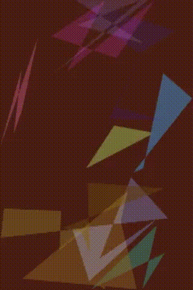
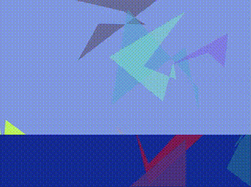

# chaotic-canvas
<p align="center">
  
  &nbsp; &nbsp; &nbsp; &nbsp;
 
</p>

<p align="center">
  
  &nbsp; &nbsp; &nbsp; &nbsp;
 
</p>


Chaotic Canvas uses genetic algorithms to evolve images. The idea is to start with a population of random images and gradually improve them to resemble a target image as closely as possible. It does this by applying genetic operations (selection, crossover, and mutation) over multiple generations to iteratively improve the population over multiple generations.

## Installation

1. Clone the repository:
```sh
git clone https://github.com/bishal0602/chaotic-canvas.git
cd chaotic-canvas
```

2. Install dependencies:
```sh
go mod tidy
```

3. Run the main program:
```ps1
go run . -target=<target_image> -out=<output_dir> -pop=<population_size> -gen=<generations> -mut=<base_mutation_rate>

 ```

## Code Structure

```
main.go                       
genetic
╰─ algorithm.go                # Main logic of GA.
╰─ individual.go               # Defines `Individual` struct and methods.
╰─ crossover.go                # Implements crossover strategies.
╰─ mutation.go                 # Mutation strategies and adaptive mutation.
╰─ selection.go                # Selection strategy for parents.
config
╰─ config.go                   
utils
╰─ color.go                    
╰─ file.go                    
╰─ maths.go                   
```
