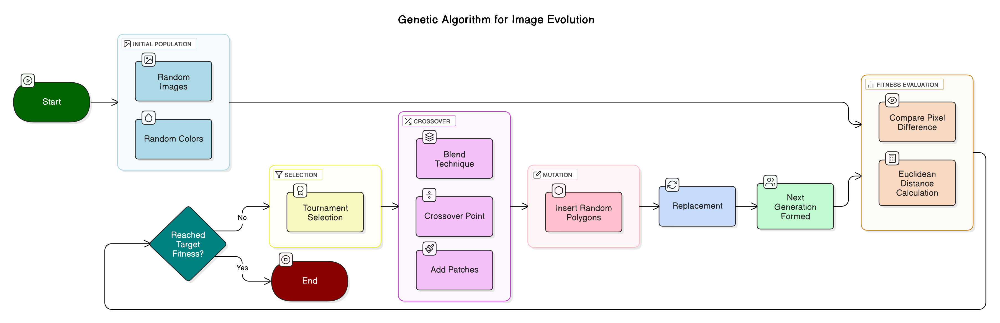

# chaotic-canvas

<p align="center">
  
  &nbsp; &nbsp; &nbsp; &nbsp;
 
</p>

<p align="center">
  
  &nbsp; &nbsp; &nbsp; &nbsp;
 
</p>

Chaotic Canvas is a genetic algorithm-based image evolution framework. It starts with a population of random images and iteratively evolves them to resemble a target image by applying genetic operations: selection, crossover, and mutation. The fitness of each individual is evaluated based on how closely it matches the target image, and the best candidates are selected for reproduction. Over successive generations, the population converges toward the target image.


## Algorithm Overview

The genetic algorithm implemented in this project follows the following flowchart:

<p align="center">
 
</p>

### Detailed Steps:

1. **Initialization**:
   - A population of random images is generated. Each image is created by using a random background colors and adding polygons with random colors and positions.

2. **Fitness Evaluation**:
   - The fitness of each individual is calculated by computing the average Euclidean distance between the RGBA values of the individual's image and the target image. Lower fitness values indicate a closer match to the target.

3. **Selection**:
   - **Tournament Selection** is used to choose parents for reproduction. A subset of the population is randomly selected, and the individual with the best fitness in the subset is chosen as a parent. This method balances exploration and exploitation by introducing randomness while favoring fitter individuals.

4. **Crossover**:
   - Offspring are generated by combining the genetic material of two parents. Multiple crossover strategies are implemented:
        - **Blend Crossover**: Interpolates pixel values between parents using a random blending factor.
        - **Single-Point Crossover**: Combines sections of images from both parents, with a random split point.
        - **Gaussian Perturbation**: Adds Gaussian noise to the average pixel values of the parents.
        - **Patch Crossover**: Swaps rectangular patches between parents to preserve local structures.

5. **Mutation**:
   - Random variations are introduced by adding or modifying polygons in the offspring. An **adaptive mutation strategy** adjusts the mutation rate dynamically based on
        - **Stagnation**: Lack of fitness improvement over generations.
        - **Diversity**: Difference between the best and average fitness.
        - **Progress**: Fraction of generations completed.

6. **Replacement**:
   - The next generation is formed by replacing less fit individuals with offspring. The population is sorted by fitness, ensuring that the best individuals are retained.

7. **Termination**:
   - The algorithm terminates when the target fitness is reached or the maximum number of generations is completed.


## Code Structure

```
main.go                       
genetic
╰─ algorithm.go                # Main logic of the genetic algorithm.
╰─ individual.go               # Defines `Individual` struct and methods.
╰─ crossover.go                # Implements crossover strategies.
╰─ mutation.go                 # Mutation strategies and adaptive mutation.
╰─ selection.go                # Selection strategy for parents.
config
╰─ config.go                   # Configuration loader for CLI arguments.
imageio                        # Image utilities.
mathutil                       # Mathematical utility functions.
```


## Installation

1. Clone the repository:
   ```sh
   git clone https://github.com/bishal0602/chaotic-canvas.git
   cd chaotic-canvas
   ```

2. Install dependencies:
   ```sh
   go mod tidy
   ```

3. Run the main program:
   ```sh
   go run . -target=<target_image> -out=<output_dir> -pop=<population_size> -gen=<generations> -mut=<base_mutation_rate>
   ```


## Command-Line Arguments

| Argument      | Description                                      | Default Value                  |
|---------------|--------------------------------------------------|--------------------------------|
| `-target`     | Path to the target image                         | `examples/afghan_girl.png`     |
| `-out`        | Output directory for generated images            | `output`                       |
| `-pop`        | Population size                                  | `500`                          |
| `-gen`        | Number of generations                            | `10000`                        |
| `-mut`        | Base mutation rate                               | `0.05`                         |
| `-tour`       | Tournament selection size                        | `6`                            |
| `-nocompress` | Disable resize compression (auto compression to a max of 540x540) | `false` |

## Example Usage

To evolve an image with a population size of 500 for 10000 generations:
```sh
go run . -target="examples/starry_night.png" -out="output" -pop=500 -gen=10000 -mut="0.1"
```
The output directory will contain intermediate images (e.g., `best_gen_100.png`) and the final evolved image (`final_result.png`).

